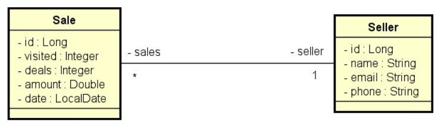

## DESAFIO: Consulta vendas - para o curso devsuperior :coffee: Java :coffee: Professional

### Relatório de vendas
1. [IN] O usuário informa, opcionalmente, data inicial, data final e um trecho do nome do vendedor.
2. [OUT] O sistema informa uma listagem paginada contendo id, data, quantia vendida e nome do
vendedor, das vendas que se enquadrem nos dados informados.

#### Informações complementares:
- Se a data final não for informada, considerar a data atual do sistema. Para instanciar a data atual.
- Se a data inicial não for informada, considerar a data de 1 ano antes da data final. Para instanciar uma data com um ano a menos, use a função minusYears:

- Se o nome não for informado, considerar o texto vazio.

### Sumário de vendas por vendedor
1. [IN] O usuário informa, opcionalmente, data inicial, data final.
2. [OUT] O sistema informa uma listagem contendo nome do vendedor e soma de vendas deste vendedor
no período informado.
#### Informações complementares:
- As mesmas do caso de uso Relatório de vendas

2.1 - Sumário de vendas por vendedor (teste 1)

    `GET /sales/summary?minDate=2022-01-01&maxDate=2022-06-30`

2.2 - Sumário de vendas por vendedor (teste 2)

    `GET /sales/summary`
    Deverá retornar o sumário de vendas por vendedor dos últimos 12 meses.

2.3 - Relatório de vendas (teste 1)

    `GET /sales/report`
    Deverá retornar o relatório de vendas dos últimos 12 meses.
2.4 - Relatório de vendas (teste 2)

    `GET /sales/report?minDate=2022-05-01&maxDate=2022-05-31&name=odinson`